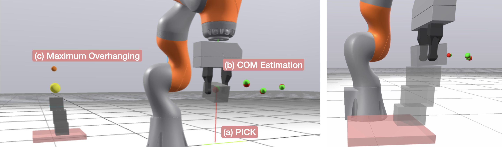

# Maximum Overhang Brick Stacking with COM Estimation



This project demonstrates autonomous brick stacking with maximum overhang using Drake and a Kuka IIWA robot. The system estimates the center of mass (COM) and mass of each brick through manipulation and uses this information to maximize the stable overhang.

## Overview
The system performs the following steps:
1. Picks up bricks individually
2. Estimates COM and mass through dynamic manipulation
3. Plans and executes optimal placement for maximum overhang
4. Maintains stack stability through careful COM tracking

### COM Estimation Process


The COM estimation process uses:
- Joint torque measurements
- Multiple manipulation poses
- Optimization-based estimation
- Visual feedback (green: estimated COM, red: actual COM)

### Stack Stability Visualization


Key visual elements:
- Yellow sphere: Stack's cumulative COM
- Cyan rectangle: Support region
- Orange marker: Maximum theoretical placement position
- Green/Red spheres: Estimated/Actual brick COMs

## Dependencies

- Drake
- Python 3.8+
- NumPy
- Pandas
- Meshcat

## Installation

1. Clone the repository:
2. Install dependencies:
```bash
pip install -r requirements.txt
```

3. Run the simulation:
I would recommend running the simulation with the jupyter notebook, but you can also run the python script.
```bash
python main.py
```
